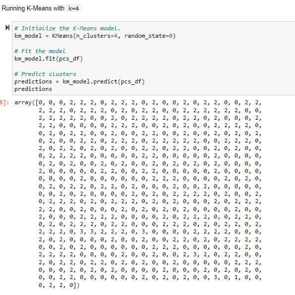

# 18Cryptocurrencies

## Overview of the Project

I've been partnered with Martha to create a report on cryptocurrency.  An company wants to offer an investment portofolio of cryptocurrency options to their customers, but they are at a loss of where to begin. And they don't want their customers to lose, so they've hired Martha and myself to get to work on this report that will include what cryptocurrencies are on the trading market and how they could be grouped to create a classification system for this new investment bank.

The data is not without fault, so it will need to be processed to fit the machine learning models using unsupervised learning grouping and a clustering algorithm. 

There are four analysis deliverables:

**Deliverable 1:** Preprocessing the Data for PCA
**Deliverable 2:** Reducing Data Dimensions Using PCA
**Deliverable 3:** Clustering Cryptocurrencies Using K-means
**Deliverable 4:** Visualizing Cryptocurrencies Results

## Results

### Deliverable 1: Preprocessing the Data for PCA

The data was preprocessed to eliminate unnecessary data:

*All cryptocurrencies that are not being traded are removed.*

*Remove the "IsTrading" column.*

*Remove rows that have at least 1 null value.*

*All the rows that do not have coins being mined are removed.*

*Keep the rows where coins are mined.*

*A new df is created that stores all cryptocurrency names from the CoinName column and retains the index from the crypto_df.*

*The get_dummies() method is used to create variables for the text features.*

*Features from the df have been standardized using the StandardScaler().*

### Deliverable 2: Reducing Data Dimensions Using PCA

*The PCA algorithm reduces the dimensions of the crypto_df down to three principal components.*

*The pcs_df is created from the three principal components and has an index from the crypto_df.*

### Deliverable 3: Clustering Cryptocurrencies Using K-means

*An elbow curve is created using hvPlot to find the best value for K.*

*Predictions are made on the K clusters of the cryptocurrencies' data.*

*A new df is created with the same index as the crypto_df and has the following columns: Algorithm, ProofType, TotalCoinsMined, TotalCoinsSupply, PC1, PC2, PC3, CoinName, & Class.*

### Deliverable 4: Visualizing Cryptocurrencies Results

*The clusters are plotted using a 3D scatter plot, and each data point shows the CoinName and Algorithm on hover.*

*A table with tradable cryptocurrencies is created using the hvplot.table() function.*

*The total number of tradable cryptocurrencies is printed.*

*A df is created that contains the clustered_df index, the scaled data, and the CoinName & Class columns.*

*A hvplot scatter plot is created where the X-axis is "TotalCoinsMined", the Y-axis is "TotalCoinSupply", the data is ordered by "Class", and it shows the CoinName when you hover over the data point.*

## Summary

Since our data set provided us with 0-4 cryptocurrencies to evaluate, those are the set parameters for our review.  Our analysis shows 3 and zero showing more prevalently than the other numbers.